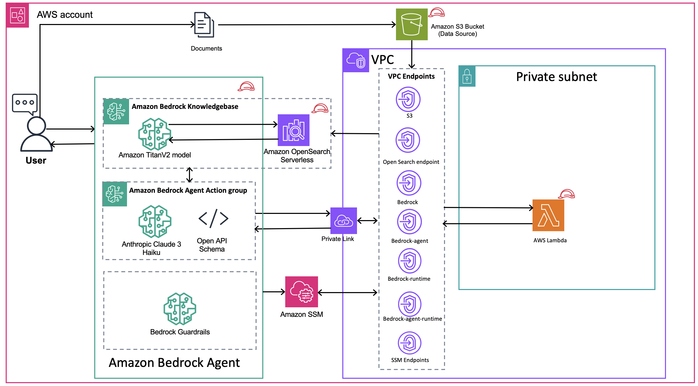

// Copyright Amazon.com, Inc. or its affiliates. All Rights Reserved.

// SPDX-License-Identifier: MIT-0

## Introduction

This solution serves as a foundational framework that can be customized and expanded to develop robust, scalable, and efficient chatbot applications on the AWS Cloud using Amazon Bedrock services. The solution now includes both backend infrastructure and a modern React-based frontend for a complete chatbot experience.

At the end, you'll gain the ability to automate the provisioning of essential components required for a GenAI chatbot, including:
- Amazon Bedrock Agents and Knowledge Bases
- Amazon Managed OpenSearch Serverless (AOSS)
- AWS Lambda functions for agent actions
- Amazon S3 buckets for knowledge bases and frontend hosting
- CloudFront distribution for global content delivery
- Cognito Identity Pool for secure AWS service access
- Proper IAM roles and permissions

The solution also includes automated custom logic lifecycle to prepare agent, create agent alias and update agent alias as and when there are any changes to the agent Action Group AWS Lambda code changes or any instructions to the Agent or the Knowledge Base to support modern and fast-paced GenAI developer environments.

## What's New: Frontend Integration

This solution now includes a complete React-based frontend that provides:
- **Modern Chat Interface**: Responsive web application for chatbot interactions
- **Real-time Messaging**: Streaming responses from Bedrock Agent
- **Conversation Management**: Create and manage multiple chat sessions
- **AWS Integration**: Direct integration with Bedrock Agent Runtime API
- **Global Deployment**: CloudFront distribution for fast worldwide access

## Architecture


## Pre-requisites
1. Install and use latest [Terraform CLI](https://developer.hashicorp.com/terraform/tutorials/aws-get-started/install-cli)
2. An AWS account with appropriate permissions
3. AWS CLI V2 version configured with credentials
4. The models used in this solution are Amazon Titan Text V2 and Claude3 Haiku. Please make sure that these are enabled in the account before deploying the code.
5. Cross check the region and the model access before deploying this.

**Note:** This solution now creates all required infrastructure (VPC, KMS key, S3 buckets) automatically. You no longer need to provide existing resources.

## Deployment instructions

### Quick Start (Pure Terraform)

For a complete automated deployment using pure Terraform:

`# customize configuration
   terraform.tfvars
   set the following

 user_email = "youremail@example.com"
 user_name = "Your Name"
 user_password = "YourSecurePassword123!"  # Optional, will generate random if not provided

# ============================================================================
# APPLICATION CONFIGURATION
# ============================================================================

app_name   = "pecarn"
env_name   = "dev"
app_region = "use1" --region set this to usw2 if want us-west-2

# ============================================================================
# VPC CONFIGURATION
# ============================================================================

vpc_cidr             = "10.0.0.0/16"  -- set to the cidr you want to use, may not matter in POC but if deployed later wont want to cross over with other IP
public_subnet_count  = 2
private_subnet_count = 2
enable_nat_gateway   = true
# Edit terraform.tfvars with your account-specific values

# Deploy
terraform init
terraform plan
terraform apply --auto-approve
```

This will:
1. Deploy all AWS infrastructure (VPC, KMS, S3, Bedrock Agent, etc.)
2. Package and deploy Lambda functions automatically
3. Deploy the React frontend
4. Provide you with the CloudFront URL to access your chatbot

### What Gets Created

The deployment creates a complete, production-ready infrastructure including:

**Core Infrastructure:**
- VPC with public and private subnets across multiple AZs
- KMS key for encryption
- S3 buckets for Lambda code and knowledge base
- NAT Gateways for private subnet internet access

**Bedrock Components:**
- Bedrock Agent with action groups
- Knowledge Base with OpenSearch Serverless
- Guardrails for content filtering
- Proper IAM roles and permissions

**Frontend Infrastructure:**
- S3 bucket for static website hosting
- CloudFront distribution for global CDN
- Cognito Identity Pool for AWS service access

**Networking & Security:**
- VPC endpoints for AWS services
- Security groups with least privilege access
- Encryption at rest and in transit

### Configuration

All configuration is handled through `terraform.tfvars`. The default values provide a working configuration, but you can customize:

- VPC CIDR blocks and subnet configuration
- Application name and environment
- Bedrock model selections
- Agent instructions and behavior
- Guardrail policies
- Resource naming conventions

## Infrastructure cleanup
For the cleanup of the infrastructure please follow below steps:
1. Empty the datasource S3 Bucket
2. Empty the frontend S3 Bucket (if deployed)
3. Navigate into the project base directory
``` 
cd intelligent-rag-bedrockagent-iac
```
3. The flag --auto-approve is optional. If you don't use that, you will be prompted to enter a confirmation manually (Y/N) 
terraform --destroy --auto-approve

## Modules

| Name | Source | Version |
|------|--------|---------|
| <a name="module_agent_update_lifecycle"></a> [agent\_update\_lifecycle](#module\_agent\_update\_lifecycle) | ./modules/bedrock/agent-lifecycle | n/a |
| <a name="module_aoss"></a> [aoss](#module\_aoss) | ./modules/aoss | n/a |
| <a name="module_bedrock_agent"></a> [bedrock\_agent](#module\_bedrock\_agent) | ./modules/bedrock/agent | n/a |
| <a name="module_bedrock_guardrail"></a> [bedrock\_guardrail](#module\_bedrock\_guardrail) | ./modules/bedrock/agent-guardrails | n/a |
| <a name="module_bedrock_knowledge_base"></a> [bedrock\_knowledge\_base](#module\_bedrock\_knowledge\_base) | ./modules/bedrock/knowledge_base | n/a |
| <a name="module_knowledge_base_bucket"></a> [knowledge\_base\_bucket](#module\_knowledge\_base\_bucket) | ./modules/s3 | n/a |
| <a name="module_roles"></a> [roles](#module\_roles) | ./modules/roles | n/a |
| <a name="module_vpc_endpoints"></a> [vpc\_endpoints](#module\_vpc\_endpoints) | ./modules/endpoints | n/a |

## Inputs

| Name | Description | Type | Default | Required |
|------|-------------|------|---------|:--------:|
| <a name="input_agent_action_group_name"></a> [agent\_action\_group\_name](#input\_agent\_action\_group\_name) | The Bedrock Agent Action Group Name | `string` | `"bedrock-agent-ag"` | no |
| <a name="input_agent_actiongroup_descrption"></a> [agent\_actiongroup\_descrption](#input\_agent\_actiongroup\_descrption) | Description of the action group of the bedrock agent | `string` | `"Use the action group to get the fitness plans, diet plans and historical details"` | no |
| <a name="input_agent_alias_name"></a> [agent\_alias\_name](#input\_agent\_alias\_name) | The Bedrock Agent Alias Name | `string` | `"bedrock-agent-alias"` | no |
| <a name="input_agent_description"></a> [agent\_description](#input\_agent\_description) | Description of the agent | `string` | `"You are a fitness chatbot"` | no |
| <a name="input_agent_instructions"></a> [agent\_instructions](#input\_agent\_instructions) | The type of agent | `string` | `"You are a helpful fitness assistant. You can answer questions related to fitness, diet plans. Use only the tools or knowledge base provided to answer user questions. Choose between the tools or the knowledge base. Do not use both. Do not respond without using a tool or knowledge base. When a user asks to calculate their BMI: 1. Ask for their weight in kilograms. 2. Ask for their height in meters If the user provides values in any other unit, convert it into kilograms for weight and meters for height. Do not make any comments about health status."` | no |
| <a name="input_agent_model_id"></a> [agent\_model\_id](#input\_agent\_model\_id) | The ID of the foundational model used by the agent. | `string` | `"anthropic.claude-3-haiku-20240307-v1:0"` | no |
| <a name="input_agent_name"></a> [agent\_name](#input\_agent\_name) | The Bedrock Agent Name | `string` | `"bedrock-agent"` | no |
| <a name="input_aoss_collection_name"></a> [aoss\_collection\_name](#input\_aoss\_collection\_name) | OpenSearch Collection Name | `string` | `"aoss-collection"` | no |
| <a name="input_aoss_collection_type"></a> [aoss\_collection\_type](#input\_aoss\_collection\_type) | OpenSearch Collection Type | `string` | `"VECTORSEARCH"` | no |
| <a name="input_app_name"></a> [app\_name](#input\_app\_name) | n/a | `string` | `"Acme"` | no |
| <a name="input_app_region"></a> [app\_region](#input\_app\_region) | n/a | `string` | `"usw2"` | no |
| <a name="input_bedrock_agent_invoke_log_bucket"></a> [bedrock\_agent\_invoke\_log\_bucket](#input\_bedrock\_agent\_invoke\_log\_bucket) | The Bedrock Agent Name | `string` | `"bedrock-agent"` | no |
| <a name="input_cidr_blocks_sg"></a> [cidr\_blocks\_sg](#input\_cidr\_blocks\_sg) | VPC/Subnets CIDR blocks to specify in Security Group | `list(string)` | `[]` | no |
| <a name="input_code_base_bucket"></a> [code\_base\_bucket](#input\_code\_base\_bucket) | Lambda Code Zip Name in S3 Bucket | `string` | `""` | no |
| <a name="input_code_base_zip"></a> [code\_base\_zip](#input\_code\_base\_zip) | Lambda Code Zip Name in S3 Bucket | `string` | `""` | no |
| <a name="input_enable_access_logging"></a> [enable\_access\_logging](#input\_enable\_access\_logging) | Option to enable Access logging of Knowledge base bucket | `bool` | `true` | no |
| <a name="input_enable_endpoints"></a> [enable\_endpoints](#input\_enable\_endpoints) | Whether to enable VPC Endpoints | `bool` | `true` | no |
| <a name="input_enable_guardrails"></a> [enable\_guardrails](#input\_enable\_guardrails) | Whether to enable Bedrock guardrails | `bool` | `true` | no |
| <a name="input_enable_s3_lifecycle_policies"></a> [enable\_s3\_lifecycle\_policies](#input\_enable\_s3\_lifecycle\_policies) | Option to enable Lifecycle policies for Knowledge base bucket Objects | `bool` | `true` | no |
| <a name="input_env_name"></a> [env\_name](#input\_env\_name) | n/a | `string` | `"dev"` | no |
| <a name="input_guardrail_blocked_input_messaging"></a> [guardrail\_blocked\_input\_messaging](#input\_guardrail\_blocked\_input\_messaging) | Blocked input messaging for the Bedrock Guardrail | `string` | `"This input is not allowed due to content restrictions."` | no |
| <a name="input_guardrail_blocked_outputs_messaging"></a> [guardrail\_blocked\_outputs\_messaging](#input\_guardrail\_blocked\_outputs\_messaging) | Blocked outputs messaging for the Bedrock Guardrail | `string` | `"The generated output was blocked due to content restrictions."` | no |
| <a name="input_guardrail_content_policy_config"></a> [guardrail\_content\_policy\_config](#input\_guardrail\_content\_policy\_config) | Content policy configuration for the Bedrock Guardrail | `any` | <pre>[<br/>  {<br/>    "filters_config": [<br/>      {<br/>        "input_strength": "MEDIUM",<br/>        "output_strength": "MEDIUM",<br/>        "type": "HATE"<br/>      },<br/>      {<br/>        "input_strength": "HIGH",<br/>        "output_strength": "HIGH",<br/>        "type": "VIOLENCE"<br/>      }<br/>    ]<br/>  }<br/>]</pre> | no |
| <a name="input_guardrail_description"></a> [guardrail\_description](#input\_guardrail\_description) | Description of the Bedrock Guardrail | `string` | `"A guardrail for Bedrock to ensure safe and appropriate content"` | no |
| <a name="input_guardrail_name"></a> [guardrail\_name](#input\_guardrail\_name) | Name of the Bedrock Guardrail | `string` | `"my-bedrock-guardrail"` | no |
| <a name="input_guardrail_sensitive_information_policy_config"></a> [guardrail\_sensitive\_information\_policy\_config](#input\_guardrail\_sensitive\_information\_policy\_config) | Sensitive information policy configuration for the Bedrock Guardrail | `any` | <pre>[<br/>  {<br/>    "pii_entities_config": [<br/>      {<br/>        "action": "BLOCK",<br/>        "type": "NAME"<br/>      },<br/>      {<br/>        "action": "BLOCK",<br/>        "type": "EMAIL"<br/>      }<br/>    ],<br/>    "regexes_config": [<br/>      {<br/>        "action": "BLOCK",<br/>        "description": "Block Social Security Numbers",<br/>        "name": "SSN_Regex",<br/>        "pattern": "^\\d{3}-\\d{2}-\\d{4}$"<br/>      }<br/>    ]<br/>  }<br/>]</pre> | no |
| <a name="input_guardrail_topic_policy_config"></a> [guardrail\_topic\_policy\_config](#input\_guardrail\_topic\_policy\_config) | Topic policy configuration for the Bedrock Guardrail | `any` | <pre>[<br/>  {<br/>    "topics_config": [<br/>      {<br/>        "definition": "Any advice or recommendations regarding financial investments or asset allocation.",<br/>        "examples": [<br/>          "Where should I invest my money?",<br/>          "What stocks should I buy?"<br/>        ],<br/>        "name": "investment_advice",<br/>        "type": "DENY"<br/>      }<br/>    ]<br/>  }<br/>]</pre> | no |
| <a name="input_guardrail_word_policy_config"></a> [guardrail\_word\_policy\_config](#input\_guardrail\_word\_policy\_config) | Word policy configuration for the Bedrock Guardrail | `any` | <pre>[<br/>  {<br/>    "managed_word_lists_config": [<br/>      {<br/>        "type": "PROFANITY"<br/>      }<br/>    ],<br/>    "words_config": [<br/>      {<br/>        "text": "badword1"<br/>      },<br/>      {<br/>        "text": "badword2"<br/>      }<br/>    ]<br/>  }<br/>]</pre> | no |
| <a name="input_kb_instructions_for_agent"></a> [kb\_instructions\_for\_agent](#input\_kb\_instructions\_for\_agent) | Description of the agent | `string` | `"Use the knowledge base when the user is asking for a definition about a fitness, diet plans. Give a very detailed answer and cite the source."` | no |
| <a name="input_kms_key_id"></a> [kms\_key\_id](#input\_kms\_key\_id) | Optional ID of the KMS key | `string` | `""` | no |
| <a name="input_knowledge_base_model_id"></a> [knowledge\_base\_model\_id](#input\_knowledge\_base\_model\_id) | The ID of the foundational model used by the knowledge base. | `string` | `"amazon.titan-embed-text-v2:0"` | no |
| <a name="input_knowledge_base_name"></a> [knowledge\_base\_name](#input\_knowledge\_base\_name) | Name of the Bedrock Knowledge Base | `string` | `"bedrock-kb"` | no |
| <a name="input_vpc_id"></a> [vpc\_id](#input\_vpc\_id) | VPC ID | `string` | `""` | no |
| <a name="input_vpc_subnet_ids"></a> [vpc\_subnet\_ids](#input\_vpc\_subnet\_ids) | List of Subnet Ids | `list(string)` | `[]` | no |

## Outputs

| Name | Description |
|------|-------------|
| <a name="output_agent_actiongroup_lambda_arn"></a> [agent\_actiongroup\_lambda\_arn](#output\_agent\_actiongroup\_lambda\_arn) | Bedrock Agent Action Group Lambda ARN |
| <a name="output_agent_actiongroup_lambda_name"></a> [agent\_actiongroup\_lambda\_name](#output\_agent\_actiongroup\_lambda\_name) | Bedrock Agent Action Group Lambda Name |
| <a name="output_agent_arn"></a> [agent\_arn](#output\_agent\_arn) | Bedrock Agent ARN |
| <a name="output_agent_id"></a> [agent\_id](#output\_agent\_id) | Bedrock Agent ID |
| <a name="output_agent_name"></a> [agent\_name](#output\_agent\_name) | Bedrock Agent Name |
| <a name="output_aoss_collection_arn"></a> [aoss\_collection\_arn](#output\_aoss\_collection\_arn) | AOSS Collection ARN |
| <a name="output_aoss_collection_id"></a> [aoss\_collection\_id](#output\_aoss\_collection\_id) | AOSS Collection ID |
| <a name="output_aoss_collection_name"></a> [aoss\_collection\_name](#output\_aoss\_collection\_name) | AOSS Collection Name |
| <a name="output_bedrock_agent_action_group_instruction"></a> [bedrock\_agent\_action\_group\_instruction](#output\_bedrock\_agent\_action\_group\_instruction) | Bedrock Agent Action Group Instruction |
| <a name="output_bedrock_agent_instruction"></a> [bedrock\_agent\_instruction](#output\_bedrock\_agent\_instruction) | Bedrock Agent Instruction |
| <a name="output_bedrock_guardrail_arn"></a> [bedrock\_guardrail\_arn](#output\_bedrock\_guardrail\_arn) | The ARN of the created Bedrock Guardrail |
| <a name="output_bedrock_guardrail_id"></a> [bedrock\_guardrail\_id](#output\_bedrock\_guardrail\_id) | The ID of the created Bedrock Guardrail |
| <a name="output_bedrock_vpc_endpoint_ids"></a> [bedrock\_vpc\_endpoint\_ids](#output\_bedrock\_vpc\_endpoint\_ids) | n/a |
| <a name="output_knowledge_base_arn"></a> [knowledge\_base\_arn](#output\_knowledge\_base\_arn) | Knowledge Base Name |
| <a name="output_knowledge_base_bucket"></a> [knowledge\_base\_bucket](#output\_knowledge\_base\_bucket) | Knowledge Base Bucket |
| <a name="output_knowledge_base_data_source_id"></a> [knowledge\_base\_data\_source\_id](#output\_knowledge\_base\_data\_source\_id) | Knowledge Base Data Source ID |
| <a name="output_knowledge_base_id"></a> [knowledge\_base\_id](#output\_knowledge\_base\_id) | Knowledge Base ID |
| <a name="output_knowledge_base_name"></a> [knowledge\_base\_name](#output\_knowledge\_base\_name) | Knowledge Base Name |
| <a name="output_lambda_code_sha"></a> [lambda\_code\_sha](#output\_lambda\_code\_sha) | SSM Paramater for Action Group Lambda SHA |
| <a name="output_s3_endpoint_id"></a> [s3\_endpoint\_id](#output\_s3\_endpoint\_id) | n/a |
| <a name="output_ssm_parameter_agent_ag_instruction"></a> [ssm\_parameter\_agent\_ag\_instruction](#output\_ssm\_parameter\_agent\_ag\_instruction) | SSM Paramater for Bedrock Agent Action Group Instruction |
| <a name="output_ssm_parameter_agent_alias"></a> [ssm\_parameter\_agent\_alias](#output\_ssm\_parameter\_agent\_alias) | SSM Paramater for Bedrock Agent Alias |
| <a name="output_ssm_parameter_agent_arn"></a> [ssm\_parameter\_agent\_arn](#output\_ssm\_parameter\_agent\_arn) | SSM Paramater for Bedrock Agent ARN |
| <a name="output_ssm_parameter_agent_id"></a> [ssm\_parameter\_agent\_id](#output\_ssm\_parameter\_agent\_id) | SSM Paramater for Bedrock Agent ID |
| <a name="output_ssm_parameter_agent_instruction"></a> [ssm\_parameter\_agent\_instruction](#output\_ssm\_parameter\_agent\_instruction) | SSM Paramater for Bedrock Agent Instruction |
| <a name="output_ssm_parameter_agent_instruction_history"></a> [ssm\_parameter\_agent\_instruction\_history](#output\_ssm\_parameter\_agent\_instruction\_history) | SSM Paramater for Agent Instruction History |
| <a name="output_ssm_parameter_agent_name"></a> [ssm\_parameter\_agent\_name](#output\_ssm\_parameter\_agent\_name) | SSM Paramater for Bedrock Agent Name |
| <a name="output_ssm_parameter_kb_instruction_history"></a> [ssm\_parameter\_kb\_instruction\_history](#output\_ssm\_parameter\_kb\_instruction\_history) | SSM Paramater for  Knowledge Base Instruction History |
| <a name="output_ssm_parameter_knowledge_base_data_source_id"></a> [ssm\_parameter\_knowledge\_base\_data\_source\_id](#output\_ssm\_parameter\_knowledge\_base\_data\_source\_id) | SSM Paramater for Knowledge Base Data Source ID |
| <a name="output_ssm_parameter_knowledge_base_id"></a> [ssm\_parameter\_knowledge\_base\_id](#output\_ssm\_parameter\_knowledge\_base\_id) | SSM Paramater for Knowledge Base ID |
| <a name="output_ssm_parameter_lambda_code_sha"></a> [ssm\_parameter\_lambda\_code\_sha](#output\_ssm\_parameter\_lambda\_code\_sha) | SSM Paramater for Action Group Lambda SHA |
| <a name="output_vpc_endpoint_ids"></a> [vpc\_endpoint\_ids](#output\_vpc\_endpoint\_ids) | n/a |
